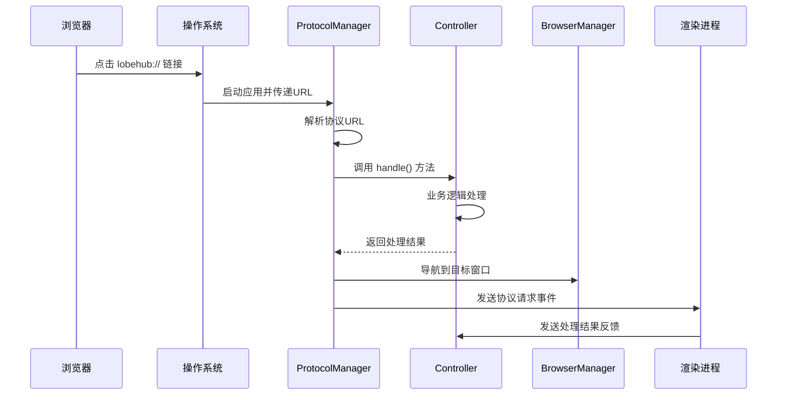

# LobeHub 协议架构设计

## 📋 概述

本文档描述了 LobeChat Desktop 中重构后的协议处理架构。新架构将协议处理逻辑完全整合到现有的 Controller 模式中，提供了更好的一致性、可扩展性和可维护性。

## 🏗️ 架构设计

### 核心组件

```
┌─────────────────────┐    ┌──────────────────────┐    ┌─────────────────────┐
│   ProtocolManager   │    │   Controller Layer   │    │   Business Logic    │
│  (Infrastructure)   │◄──►│  (Protocol Handlers) │◄──►│   (IPC Events)      │
└─────────────────────┘    └──────────────────────┘    └─────────────────────┘
         │                           │                           │
         ▼                           ▼                           ▼
┌─────────────────────┐    ┌──────────────────────┐    ┌─────────────────────┐
│  System Protocol    │    │   Route Config &     │    │   Renderer Process  │
│   Registration      │    │   Window Navigation  │    │   Event Handling    │
└─────────────────────┘    └──────────────────────┘    └─────────────────────┘
```

### 1. **ProtocolManager** (基础设施层)

- **位置**: `apps/desktop/src/main/core/infrastructure/ProtocolManager.ts`
- **职责**:
  - 协议注册到操作系统
  - URL 捕获和预处理
  - 路由配置管理
  - 处理器调度和窗口导航

### 2. **Controller-based Handlers** (控制器层)

- **位置**: `apps/desktop/src/main/controllers/*ProtocolCtr.ts`
- **职责**:
  - 实现 `ProtocolHandler` 接口
  - 特定协议的业务逻辑处理
  - IPC 事件处理
  - 安全验证和参数校验

### 3. **Protocol Types** (类型定义)

- **位置**: `src/types/plugins/protocol.ts`
- **职责**:
  - 协议相关的 TypeScript 接口
  - 路由配置类型
  - 处理器接口定义

## 🎯 设计原则

### 1. **一致性**

- 协议处理器使用与其他功能相同的 Controller 模式
- 统一的装饰器和生命周期管理
- 一致的错误处理和日志记录

### 2. **可扩展性**

- 新的协议类型只需创建新的 Controller
- 自动发现和注册机制
- 灵活的路由配置系统

### 3. **职责分离**

- ProtocolManager: 基础设施和路由
- Controllers: 业务逻辑和验证
- App: 初始化和集成

## 🔧 使用指南

### 创建新的协议处理器

#### 1. 创建 Controller

```typescript
// apps/desktop/src/main/controllers/MyProtocolCtr.ts
import type { ProtocolHandler, ProtocolUrlParsed } from '@/types/plugins/protocol';
import { createLogger } from '@/utils/logger';

import { ControllerModule, ipcClientEvent } from './index';

const logger = createLogger('controllers:MyProtocolCtr');

export default class MyProtocolCtr extends ControllerModule implements ProtocolHandler {
  readonly type = 'my-protocol';
  readonly supportedActions = ['action1', 'action2'];

  async handle(
    parsed: ProtocolUrlParsed,
  ): Promise<{ success: boolean; error?: string; targetWindow?: string }> {
    // 处理逻辑
    return {
      success: true,
      targetWindow: 'chat', // 或 'settings'
    };
  }

  @ipcClientEvent('myProtocolHandled')
  async handleResult(data: { url: string; success: boolean; error?: string }) {
    // 处理结果反馈
    return { success: true };
  }
}
```

#### 2. 添加路由配置（可选）

```typescript
// 在 ProtocolManager.initializeDefaultRoutes() 中添加
{
  type: 'my-protocol',
  action: 'action1',
  targetWindow: 'chat',
  targetPath: 'my-path'
}
```

#### 3. 自动注册

系统会自动发现并注册实现了 `ProtocolHandler` 接口的 Controller，无需手动注册。

### 协议 URL 格式

```bash
# 基本格式
lobehub://[type]/[action]?[parameters]

# MCP 安装示例
lobehub://mcp/install?identifier=figma &
source=official

# Agent 导入示例（如果实现了 AgentProtocolCtr）
lobehub://agent/import?identifier=my-agent &
source=community
```

## 📊 当前实现状态

### ✅ 已实现的协议处理器

#### 1. **ProtocolCtr** (MCP 协议)

- **类型**: `mcp`
- **支持操作**: `install`, `configure`, `update`
- **目标窗口**: `settings`
- **路由路径**: `plugin`

#### 2. **AgentProtocolCtr** (示例)

- **类型**: `agent`
- **支持操作**: `import`, `share`, `preview`
- **目标窗口**: 动态决定（`chat` 或 `settings`）

### 🔄 处理流程



## 🛠️ 开发和调试

### 日志查看

```bash
# 开发模式下查看协议相关日志
[core:ProtocolManager] Registering protocol handlers for lobehub://
[controllers:ProtocolCtr] Registering controller ProtocolCtr as protocol handler
[controllers:ProtocolCtr] Handling MCP protocol request: {...}
```

### 测试协议

```bash
# macOS
open "lobehub://mcp/install?identifier=test&source=official"

# Windows
start "" "lobehub://mcp/install?identifier=test&source=official"

# Linux
xdg-open "lobehub://mcp/install?identifier=test&source=official"
```

## 🎉 架构优势

### 1. **与现有架构一致**

- 使用相同的 Controller 模式
- 统一的装饰器系统
- 一致的依赖注入机制

### 2. **自动发现和管理**

- 无需手动注册处理器
- 自动类型检查和验证
- 统一的生命周期管理

### 3. **灵活的路由系统**

- 基于配置的窗口路由
- 处理器可以动态覆盖路由
- 支持复杂的导航逻辑

### 4. **强类型支持**

- 完整的 TypeScript 类型定义
- 编译时类型检查
- 优秀的 IDE 支持

### 5. **易于测试和维护**

- 清晰的职责分离
- 独立的业务逻辑
- 标准化的错误处理

## 🚀 未来扩展

这个架构为未来的协议扩展提供了强大的基础：

- **模型分享协议**: `lobehub://model/share?id=xxx`
- **工作流协议**: `lobehub://workflow/import?url=xxx`
- **配置同步协议**: `lobehub://config/sync?source=xxx`
- **插件市场协议**: `lobehub://market/browse?category=xxx`

每个新协议只需要创建一个新的 Controller 即可，系统会自动处理注册和路由。
