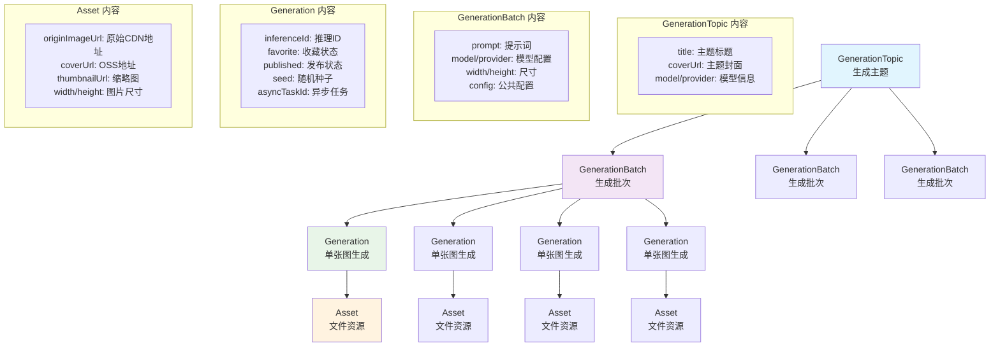

## 背景

- <https://github.com/lobehub/lobe-chat/discussions/4741>
- progress: <https://github.com/lobehub/lobe-chat/pull/7920>

## 目标

针对 AI 绘画场景的创作工具。

## 开发计划

### 一期目标

AI 绘画场景下基本的文生图功能。

同时，为了系统的扩展性和未来其它需求做铺垫需要设计实现下面这些架构。

#### 多 providers 架构

这本身就是 lobe chat 的核心优势之一，把 chat 的多 provider 功能延续到其它模态。

就是说可以使用不同 provider 提供的 image 模型，例如 openai provider 的 gpt-4o-image, dalle3, google provider 的 imagen-4, fal 的上百种 ai 模型。

常见的 provider 还有 replicate, runware, together.ai, stablity.ai, ttapi, kling, seedream 等。

一期将率先支持 fal.ai, openai，本来也想支持 google 的 imagen-4 的，但是发现目前 google 官方的 imagen-4 只支持 vertex ai 调用，不如先支持 fal 的 imagen-4。

#### 任务执行模型

在 AI 生成任务中，我们可以从用户体验和技术实现两个维度来分析。

##### 用户体验：同步 vs. 异步

从用户体验的角度看，任务可以分为两种模式：

- **同步任务 (Synchronous Task):** 用户发起操作后，界面会一直处于等待状态，直到任务完成并返回最终结果。
- **异步任务 (Asynchronous / Background Task):** 用户发起操作后，系统立即给出"任务已开始"的反馈，用户可以继续使用应用的其他功能。任务在后台执行，完成后再通过通知或界面更新等方式呈现结果。

**结论：** 为了提供更好的用户体验，避免用户在不确定的等待中感到沮喪，**AI 绘画功能将仅支持异步任务模式**。

##### 技术实现：阻塞式请求 vs. Webhook/后台队列

实现异步的用户体验，后端有多种技术方案。原先我们讨论过两种主要方式：

- **阻塞式请求 (Blocking Request):** 客户端发送请求后，服务端的处理函数会一直运行（阻塞），直到 AI 模型生成结果，然后将结果返回给这一个请求。这本质上是一种长轮询。
  - **优点：** 实现相对简单，在一个请求-响应周期内完成。
  - **缺点：** 极易受到 Serverless 平台的执行时间限制。例如，Vercel 的免费版函数最长只能运行 60 秒，对于耗时较长的模型（如高清出图）来说，很容易超时失败。
- **Webhook / 后台任务队列:** 客户端发送请求后，服务端仅将任务信息（例如交给 `trigger.dev` 或支持 webhook 的 AI Provider）推送到一个后台队列中，然后立即响应客户端，告知任务已创建。当后台任务完成后，通过 Webhook 等机制回调我们的服务来更新任务状态。
  - **优点：** 完美契合 Serverless 架构，没有执行时间限制，稳定性和扩展性更好。
  - **缺点：** 实现相对复杂，需要额外的 webhook 接口和状态管理逻辑。

**实施计划：**

1.  **第一版实现：** 为了快速上线，我们将采用 **阻塞式请求** 的方式，通过 `tRPC` 的 `async router` 在服务端执行生成任务。我们会接受其在 Serverless 平台上的超时限制。
2.  **数据库要求：** 无论是哪种实现，管理异步任务的状态都需要一个持久化的 `async_task` 表。因此，此功能**必须依赖服务端数据库**，不支持纯客户端数据库模式。
3.  **未来演进：** 后续，我们将把架构演进到更健壮的 **Webhook / 后台任务队列**模式，以彻底解决超时问题，并为更复杂的任务调度（如优先级队列）提供基础。

#### 多模态

虽然这一期只做 AI 生图，但是也需要在设计层面为 `AI 视频`，`AI 音乐` 等更多模态做好准备。

其中最最重要的两块是：数据库设计和全局状态设计，前期没设计好后面迁移起来贼麻烦。

举例说明一下数据库怎么设计对多模态比较友好：无论是 AI 生图还是视频，我们预计可能都会支持收藏，发布，软删除等功能。那这些功能其实是多模态公共的能力。如果针对每个模态定义对应的表去存储这些状态，也就是

```typescript
const imageGenerations = pgTable('image_generations', {
  isPublished: boolean().default(false).notNull(),
  isFavorite: boolean().default(false).notNull(),
  // image config
  prompt: text().notNull(),
});

const videoGenerations = pgTable('video_generations', {
  isPublished: boolean().default(false).notNull(),
  isFavorite: boolean().default(false).notNull(),
  // video config
  prompt: text().notNull(),
  startFrame: integer().notNull(),
});
```

那这样我们在实现收藏功能的时候就需要实现多个接口，或者针对不同的模态去访问对应的表，n 个模态逻辑复杂度就是 n。

但是如果我们抽取公共的 generation 表，把公共业务逻辑数据放在 generation 表上，例如收藏，发布：

```typescript
const generations = pgTable('generations', {
  isPublished: boolean().default(false).notNull(),
  isFavorite: boolean().default(false).notNull(),
  configId: varchar('config_id', { length: 64 }).notNull(),
});

const imageConfigs = pgTable('image_configs', {
  generationId: varchar('generation_id', { length: 64 }).notNull(),
  prompt: text().notNull(),
});

const videoConfigs = pgTable('video_configs', {
  generationId: varchar('generation_id', { length: 64 }).notNull(),
  prompt: text().notNull(),
  startFrame: integer().notNull(),
});
```

那我们实现收藏功能的时候其实只需要针对 generation 表做更新就好了，不需要针对 imageConfigs 和 videoConfigs 表做更新, n 个模态逻辑复杂度也还是 1。

如果我们要做 gallery（渲染 published 状态的 generation），其中既要展示图片，又要展示视频，那我们只需要针对 generation 表做查询就好了，不需要针对 imageConfigs 和 videoConfigs 表做查询。

### 后续计划

- 图生图
- 支持更多 provider，例如 midjourney discord/TTAPI, replicate/runware/kling/seedream 等
- 访问特定 generationTopic 恢复 topic 状态
- generationTopic 列表无限加载
- web 移动端
- 绘图模型 pricing 显示和 cloud 版本计费
- prompt translate/enhance
- 绘画模态下实现 LLM 辅助生图
- 对比多个模型生成
- 图片语义化搜索
  - 一期不支持，主要考虑到图片向量化需要自部署 [clip](https://huggingface.co/openai/clip-vit-large-patch14) 模型或者引入[第三方模型服务](https://replicate.com/andreasjansson/clip-features)，但感觉基于 prompt 的搜索好像满足了大多数场景。简单来说就是成本比较高，但是需求感觉不强烈
  - 但需要了解的是，后序如果要支持，数据迁移是个问题

## 界面

### 桌面端

示意界面如下：[v0](https://v0.dev/chat/ai-painting-interface-3h7HmcJkb25)


一期配置面板目标就是能用，后续可以做得更易用，图形化一些，参考 <https://shots.so/>。

- 左边是配置面板，包括模型选择，生成配置参数。provider 设置直接在现有的 LLM provider 配置那新增 fal.ai 等
- 中间主体是生成列表
- 中间下方是 prompt 输入框
- 右边是 generation topics 列表。点击生成按钮时，如果当前没有生成记录会创建一个 generation topic，点开一个 topic 下方展示所有生成批次的缩略图，每个缩略图取批次内第一张图，类似 figma


### 移动端

桌面端和移动端实现可以独立拆分，考虑到工作量问题，放二期实现。

参考了即梦 app 的设计，简单示例：


## 数据库设计

### providers 管理

统一在现有的 AI 服务商设置那里管理：


### 多 providers 架构

项目中已经存在 AiProvider 和 AiModel 两张表。

#### AiProvider

```typescript
// src/database/schemas/aiInfra.ts
export const aiProviders = pgTable(
  'ai_providers',
  {
    id: varchar('id', { length: 64 }).notNull(),
    name: text('name'),

    userId: text('user_id')
      .references(() => users.id, { onDelete: 'cascade' })
      .notNull(),

    sort: integer('sort'),
    enabled: boolean('enabled'),
    fetchOnClient: boolean('fetch_on_client'),
    checkModel: text('check_model'),
    logo: text('logo'),
    description: text('description'),

    // need to be encrypted
    keyVaults: text('key_vaults'),
    source: varchar('source', { enum: ['builtin', 'custom'], length: 20 }),
    // 1. 扩充 AiProviderSettings 字段
    // 2. baseSettings + type 字段 + 新类型，例如 AiLLMProviderSettings | AiImageProviderSettings
    settings: jsonb('settings')
      .$defaultFn(() => ({}))
      .$type<AiProviderSettings>(),

    ...timestamps,
  },
  (table) => [primaryKey({ columns: [table.id, table.userId] })],
);
```

- 目前看下来暂不需要调整 schema，现有的字段够用
- 一期暂不支持添加自定义 provider
- 不在 provider 层面区分模态，在 model 层面区分，model 表有个 type 字段可以区分

#### AiModel

```typescript
export const aiModels = pgTable(
  'ai_models',
  {
    id: varchar('id', { length: 150 }).notNull(),
    displayName: varchar('display_name', { length: 200 }),
    description: text('description'),
    organization: varchar('organization', { length: 100 }),
    enabled: boolean('enabled'),
    providerId: varchar('provider_id', { length: 64 }).notNull(),
    type: varchar('type', { length: 20 }).default('chat').notNull(),
    sort: integer('sort'),

    userId: text('user_id')
      .references(() => users.id, { onDelete: 'cascade' })
      .notNull(),
    // 可能是动态的需要代码实现，扣费逻辑
    // 可以在 agentRuntime 中使用代码去实现
    pricing: jsonb('pricing'),
    // AI 绘画模型希望保存 schema
    parameters: jsonb('parameters').default({}),
    config: jsonb('config'),
    abilities: jsonb('abilities').default({}),
    contextWindowTokens: integer('context_window_tokens'),
    source: varchar('source', { enum: ['remote', 'custom', 'builtin'], length: 20 }),
    releasedAt: varchar('released_at', { length: 10 }),

    ...timestamps,
  },
  (table) => [primaryKey({ columns: [table.id, table.providerId, table.userId] })],
);

// LLM pricing
{
    pricing: {
      audioInput: 100,
      audioOutput: 200,
      cachedAudioInput: 20,
      cachedInput: 2.5,
      input: 5,
      output: 20,
    }
}
```

- 目前看下来一期也不需要调整 schema，现有的字段够用
- aiModel 的 type 字段现在只有 chat 这一个值，引入 ai 绘画后，针对 ai 绘画场景应该是 image
- parameters 我看目前其它 ai 模型没有用到这个字段， 对于 ai 绘画就很重要了，它是生成左侧配置面板的依据。目前是希望存储 JSON Schema，这样可以充分描述侧边栏支持的配置项，给用户提供更好的交互。例如对于 cfgScale，可以描述 step/min/max，使用 slider 渲染 cfgScale 参数就很有用
- pricing：目前 LLM 是一个对象，对 AI 绘画场景已有的字段都不适用，
  - 对于 LLM 原生支持出图的模型，例如 dalle, [gpt-4o-image](https://platform.openai.com/docs/pricing#image-generation) 这类是按 token 计算的。dalle 输入 text 和 image 不算 cost，gpt-4o-image 输入 text 和 image 却参于 cost 计算。不同的尺寸也不是严格按像素大小算差价的，例如同样 low quality, 1024 x 1024 是 $0.011 $/1M token, 而 1024 x 1536 不是 0.011 x (1536 / 1024) 得到的 0.0165，而是 0.016，相对于折扣掉第三位小数后的价格。简单来说比 chat llm 单纯按 token 计算复杂的多。
  - 对于大多数 diffusion 架构的模型，一般是按张数算钱的，但是根据配置的不同单张的价格可能不同，例如 <https://fal.ai/models/fal-ai/recraft-v3/playground> recraft 模型 style 选择 vector 类的和别的价格不一样
  - 结论：
    - 可能还是得在 agentRuntime 暴露一个方法让用户根据生成参数计算当前 cost
    - 这个不影响用户使用，放二期实现

### 生成系统

其实就是中间这个生成列表的数据库设计。概述下各个表之间的关系：

- 一个 generationTopic 下有多个 generationBatch
- 一个 generationBatch 下有多个 generation，generationBatch 会存储这一个批次多张图共同使用的配置。
- 每个 generation 有它的 asset
  - generation 需要保存它自己推理相关的信息，例如用于 webhook 识别任务的 inferenceId，当前生成状态是 pending 还是 failed
  - generation 需要保存用户各种操作相关字段，例如收藏，发布状态
  - asset 存储生成的文件信息，例如图片模态下，存储 width/height/originImageUrl/imageUrl/thumbnailUrl。originImageUrl 指的是 apiProvider 它们返回得图片 cdn 地址，一般很快会过期，我们需要保存到我们自己的 oss。
    - 前端渲染图片时需要考虑 oss 加密场景下怎么获取完整 url
    - 因为不是所有 oss 都支持 url 参数 resize，需要自己实现生成缩略图
      - 生成缩略图策略：有一边超过 512，就裁到 512 x 512 范围内，并且转成 webp



#### GenerationBatch

抽象一个生成批次。


```typescript
export const generationBatches = pgTable('generation_batches', {
  id: text('id')
    .$defaultFn(() => idGenerator('sessions'))
    .notNull()
    .primaryKey(),
  userId: text('user_id')
    .references(() => users.id, { onDelete: 'cascade' })
    .notNull(),
  generationTopicId: text('generation_topic_id')
    .notNull()
    .references(() => generationTopics.id, { onDelete: 'cascade' }),
  // 一期只做文生图这俩字段到需要用到的时候再加不迟
  // type: pgEnum('generation_type', ['image', 'video', 'upscale']).notNull(),
  // category: pgEnum('generation_type', ['textToImage', 'imageToImage',]).notNull(),

  // 下面这些也是模型配置，考虑到用户搜索过滤需求，放顶层字段方便加索引
  provider: text().notNull(),
  model: text().notNull(),
  prompt: text().notNull(),
  // 一期先不做 prompt 翻译
  // translatedPrompt: text();
  width: integer(),
  height: integer(),
  ratio: varchar('ratio', { length: 64 }),

  // 存储这个生成批次的配置，存放不需要建议索引的公共配置
  config: jsonb('config'),
  ...timestamps,
});
```

图片的语义化搜索（后续功能）：

- elastic search 不考虑，自部署太麻烦
- postgres 自带的向量搜索
  - generation 增加一个 imageEmbedding 字段，vector 类型，图片生成之后生成向量（需要使用一个合适的图片转向量工具）
  - 一期不实现此功能，主要考虑成本和需求优先级

#### Generation

单张图的生成。

- 存储对 generation 的用户操作，例如收藏
- 推理相关使用额外的表 async task

重试逻辑：generation 保持不变，生成新的 async task

各种 prompt：

- prompt: 用户输入的 prompt
- translatedPrompt: 用户输英语以外的语言，翻译成英文的 prompt, 一个批次四张图都一样，存到 generationBatch 上
- enhancedPrompt: 一个批次四张图，每张图都要走 LLM enhance 一次，每次 enhance 结果不一样，存到 generation 上
- negativePrompt

```typescript
export const generations = pgTable('generations', {
  id: text('id')
    .$defaultFn(() => idGenerator('messages'))
    .primaryKey(),
  userId: text('user_id')
    .references(() => users.id, { onDelete: 'cascade' })
    .notNull(),
  /** 关联的生成批次 ID */
  generationBatchId: varchar('generation_batch_id', { length: 64 })
    .notNull()
    .references(() => generationBatches.id, { onDelete: 'cascade' }),

  // inference related
  // 复用已有的 async_tasks 表
  asyncTaskId: uuid('async_task_id').references(() => asyncTasks.id, { onDelete: 'cascade' }),

  // user actions - 后续实现
  // 收藏功能，用于用户标记喜欢的生成结果
  // favorite: boolean().default(false).notNull(),
  // 发布到 gallery 功能，用于分享优秀作品到公共画廊
  // published: boolean().default(false).notNull(),

  // 每个 generation 独有的配置，比较少，暂时直接放顶层
  seed: text(),
  // 后期做这个功能时再加
  // enhancedPrompt: text();

  // 直接对图片的 upscale 可以考虑把升级后的地址放 asset
  asset: jsonb('asset'),
  // { imageUrl: '', thumbnailUrl: '', image2x: '', width: 1024, height: 1024 }
  fileId: text('file_id').references(() => files.id, { onDelete: 'set null' }),

  // 图片语义化搜索功能 - 后续实现
  // imageEmbedding: vector(1536),
  ...timestamps,
});

// 也是之前就有的表
export const asyncTasks = pgTable('async_tasks', {
  id: uuid('id').defaultRandom().primaryKey(),
  type: text('type'),

  status: text('status'),
  error: jsonb('error'),

  userId: text('user_id')
    .references(() => users.id, { onDelete: 'cascade' })
    .notNull(),
  duration: integer('duration'),

  // 需要新增加
  inferenceId: varchar({ length: 128 }).notNull(), // webhook 需要用
  // 推理结束的时间，不论成功或失败
  finalizedAt: timestamp(),

  ...timestamps,
});
```

#### GenerationTopic

- 图片是根据用户已经生成的图片（例如第一张）裁剪到 128 x 128 的，不复用 generation 的，因为 generation 可能被删除
- 点开 topic 显示的 generationBatch 缩略图不需要生成，直接用 generationBatch 的第一张图的缩略图
- 直接访问某个 topic时，需要恢复 topic 状态，例如 model, prompt, 配置项等，这个放二期再做，先上 reuse 功能平替一下。

```typescript
export const generationTopics = pgTable('generation_topics', {
  id: text('id')
    .$defaultFn(() => idGenerator('topics'))
    .notNull()
    .primaryKey(),
  userId: text('user_id')
    .references(() => users.id, { onDelete: 'cascade' })
    .notNull(),
  // 简要描述主题内容, LLM 生成，复用 chat 的 topic title 生成
  title: text('title').notNull(),
  coverUrl: text('cover_url'),
  ...timestamps,
});
```

#### 多模态相关的思考

按照目前的设计，从命名也可以看出来，generationTopic/generationBatch/generation 是多模态通用的。

这意味着：

1. 除了图片，视频，音乐也支持一次性生成多个。市面上大约一半的平台不支持一次性生成多张视频。例如 krea, runway, pika, 也有一些事支持的，例如 kling, vidu, seaart。
2. 对于不同模态差异部分
   - 核心差异主要是两部分：生成配置（config）和生成输出（asset）
   - 解决方案是：扩充顶层字段和使用 json 类型字段
   - 拿 generationBatch 存储的生成配置来说，对于查询速度要求高的字段例如 prompt, 直接放顶层，对于查询速度要求不高的字段放 config 字段中。不同模态的差异体现在顶层字段的扩充和 config 的多态（指的是字段不一样）

## Midjourney

目前调用 provider 的时候预期调用方式是 4 张图调用 4 次推理请求，webhook 回调的时候回调 4 次，绝大多数 AI 绘画 provider 都可以实现。

midjourney 它的生成和其它生成不一样，webhook 回调返回得是一张图包含四个缩略图，在这种情况下，希望 provider 在 agentRuntime 层自己做切成 4 张图的逻辑，或者我们自己提供一个切图服务给它们调用。

## 多 provider 适配

和 LLM 不太一样的是，图片生成和视频生成大多都比较耗时，一般走的是 webhook 回调，目前 agentRuntime 可能不足以满足需求。

### 方案一

在增加 provider 的时候增加一个对应的 webhook 路由，在其中处理对应 provider 的回调逻辑。

### 方案二

使用单一 webhook 路由，每个 providerRuntime 提供 match 方法和 handle 方法。match 方法返回 true 就调用对应 handle 方法处理生成回调。

结论：这块得结合异步任务架构一起讨论。

## AI 绘画入口

我觉得最方便最不和现有设计冲突的地方还是直接左侧侧边栏加一个 item，点击后打开新页面。或者暂时可以这样设计，后序引入 projects 概念后整合进 projects。


## AI Image 参数标准化

不同的 ai image provider 的模型参数名称，case 都不一样，例如 [fal](https://fal.ai/models/fal-ai/flux/dev) 的 cfg 参数是 guidance_scale，但是 [runWare](https://my.runware.ai/playground?modelAIR=runware%3A100%401&modelArchitecture=flux1s) 的参数又是 CFGScale。
需要定制一套统一的标准化的参数名称。

好处:

- 希望给用户呈现在不同 provider 的不同 models 下能有一致的 UI，例如：选 fal 的 flux 和 runware 的 flux 对应 cfg 参数名都是 cfgScale，配置面板渲染配置 UI 的时候读到 cfgScale 参数显示的 label 就统一都是：Prompt Adherence (CFG)。如若不然，那就是根据 params schema 的 description 去渲染 label，description 不同，对应 label 就不同。用户就会有不一致的交互
- 前端可以针对标准化参数做 UI 优化，后端数据库针对参数建索引

一期支持的参数:

- prompt: string
- width/height: integer
- aspectRatio: string enum, 命名来源：[fal](https://fal.ai/models/fal-ai/imagen4/preview), [vertextai](https://cloud.google.com/vertex-ai/generative-ai/docs/model-reference/imagen-api) 都是用这个
- size: string enum, 命名来源 [openai](https://platform.openai.com/docs/api-reference/images/create#images-create-size), [recraft](https://www.recraft.ai/docs#generate-image) 都是用这个
- cfg: number
- steps: number
- seed: number

考虑可以借鉴 comfyUI 官方节点的参数名称：


### 模型参数示例

新增一个模型支持需要到对应的文件夹新增 json 文件，例如 fal 新增 flux-schnell 支持需要新增 `src/config/paramsSchemas/fal/flux-schnell.json`：

```json
{
  "properties": {
    "prompt": {},
    "width": {
      "minimum": 512,
      "maximum": 1536,
      "step": 1,
      "default": 1024
    },
    "height": {
      "minimum": 512,
      "maximum": 1536,
      "step": 1,
      "default": 1024
    },
    "steps": {
      "minimum": 1,
      "maximum": 12,
      "default": 4
    },
    "seed": {}
  },
  "required": ["prompt"],
  "type": "object"
}
```

然后在 `src/config/aiModels/fal.ts` 中使用：

```typescript
import FluxSchnellParamsSchema from '../paramsSchemas/fal/flux-schnell.json';

const googleChatModels: AIImageModelCard[] = [
  {
    description: '...',
    displayName: 'FLUX.1 [schnell]',
    enabled: true,
    id: 'flux/schnell',
    parameters: FluxSchnellParamsSchema,
    releasedAt: '2024-08-01',
    type: 'image',
  },
];
```
