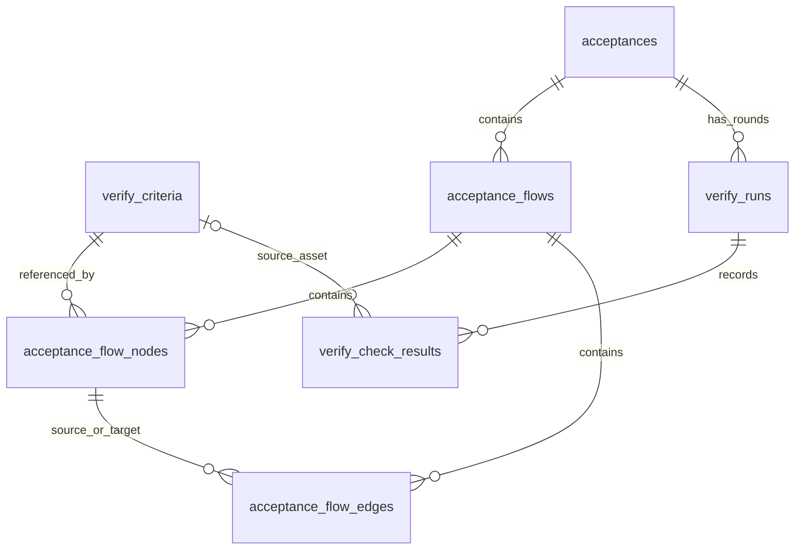

# 检查资产与验收流程：表结构修订方案

状态：本分支按此方案实现；具体 CLI 契约见 `acceptance-flows.md`。验证记录单独发布到原 acceptance。

## 目标与实体边界

`verify_criteria` 是用户或 workspace 的检查资产。Agent 创建检查项时就保存资产，不再要求 “保存为模板”。资产包含如何复现和如何判断；每轮的实际观察、证据、反馈属于验证结果。

流程节点是资产在流程中的一次引用。同一资产可以在多个流程或同一流程的多个位置出现。节点 ID、资产 ID、验收检查项 ID 三者不能混用。



图中的两条路径通过 `verify_runs.flow_snapshots`、`plan` 的来源 ID 和冻结内容连接，而不是读取当前资产来重建历史。

## 1. 扩展 verify\_criteria

保留现有主键、user\_id、workspace\_id、title、description、required、on\_fail、verifier\_type、verifier\_config、document\_id 和时间戳。

| 新增列       | PostgreSQL 类型 | 空值与默认值     | 用途                                                      |
| ------------ | --------------- | ---------------- | --------------------------------------------------------- |
| definition   | jsonb           | 可空，无默认值   | 结构化复现和验收定义；旧记录可继续解析原 verifier\_config |
| tags         | text\[]         | 非空，默认空数组 | 搜索与分类；不是权限或身份标识                            |
| archived\_at | timestamptz     | 可空             | 归档后默认不出现在复用搜索中，既有引用仍可解析            |

定义使用共享 TypeScript 类型及服务端运行时校验：

```typescript
interface VerifyCheckDefinition {
  preconditions?: string[];
  fixtures?: VerifyCheckFixture[];
  steps?: VerifyCheckStep[];
  expected?: string;
}

interface VerifyCheckFixture {
  id: string;
  name: string;
  description?: string;
  resource?: { type: 'file' | 'document'; id: string };
  data?: Record<string, unknown>;
}

interface VerifyCheckStep {
  id: string;
  instruction: string;
  expected?: string;
  fixtureIds?: string[];
}
```

- steps 数组顺序决定执行顺序，step/fixture ID 在同一检查定义内唯一且在编辑时保持稳定。
- 校验 fixtureIds 指向定义中真实存在的 fixture；文件和文档引用需校验当前 scope 的访问权限。JSON 引用不具备数据库外键约束，必须由服务层处理失效引用。
- fixture.data 保存 JSON 兼容的复现输入；账号、环境使用角色和资源引用，不把运行时凭据写入可复用定义。
- verifier\_config 保留验证器专属参数；通用 method/expected 由兼容解析器转换成 definition.steps/expected。新写入只写结构化定义；definition 存在时不与旧字段拼接，避免旧预期重新出现。
- document\_id 继续保存说明文档关联；不在 definition 内复制一份可编辑的相同说明。
- 归档是常规移除操作；被活动节点引用的资产禁止硬删除。

权限复用现有 buildWorkspaceWhere/buildWorkspacePayload：个人范围按 user\_id 且 workspace\_id 为空；workspace 范围按 workspace\_id，user\_id 记录创建人。关联流程时检查资产和 acceptance 的范围匹配，不能只凭 UUID 引用其他范围资产。

索引：保留当前 user/workspace 索引；初版不额外增加 tags GIN 或全文索引。新增查询先按范围过滤，按实际查询与数据规模增加索引。

## 2. acceptance\_flows：当前流程定义

本轮保留流程归属于 acceptance；检查资产独立于 acceptance。删除 acceptance 不删除检查资产。跨 acceptance 挂载同一流程资产暂不引入，后续如有需要再拆流程归属关系。

| 列                                       | 类型            | 约束 / 用途                             |
| ---------------------------------------- | --------------- | --------------------------------------- |
| id                                       | uuid            | 主键，默认生成                          |
| acceptance\_id                           | uuid            | 非空，FK acceptances，ON DELETE CASCADE |
| title                                    | text            | 非空                                    |
| goal                                     | text            | 可空，流程整体目标                      |
| preconditions                            | jsonb/string\[] | 可空，流程级前置条件                    |
| created\_at / updated\_at / accessed\_at | timestamptz     | 复用 timestamps                         |

acceptance\_id 增加普通索引。整体图更新在事务中锁定 flow，读取并比较调用方提供的旧图内容 hash，检测覆盖冲突；无需版本表。所有图和资产修改、快照实例化采用一致锁顺序。

入口以节点 is\_entry 表达，避免 flow\.entry\_node\_id 与 nodes.flow\_id 的循环外键。允许空草稿，发布 / 执行要求恰好一个入口。

## 3. acceptance\_flow\_nodes：检查资产的流程引用

| 列            | 类型    | 约束 / 用途                                                          |
| ------------- | ------- | -------------------------------------------------------------------- |
| id            | uuid    | 主键，流程编辑时保留稳定 ID                                          |
| flow\_id      | uuid    | 非空，FK flows，ON DELETE CASCADE                                    |
| criterion\_id | uuid    | 非空，FK verify\_criteria，ON DELETE NO ACTION，延迟到事务提交时检查 |
| is\_entry     | boolean | 非空，默认 false                                                     |
| overrides     | jsonb   | 可空，类型化的场景覆盖                                               |

新增 UNIQUE (flow\_id, id)，供连线的复合外键使用；criterion\_id 普通索引用于反向查找使用该资产的流程。对 flow\_id WHERE is\_entry 建部分唯一索引，限制每图最多一个入口；服务校验非空可执行图至少一个入口。

不增加 UNIQUE (flow\_id, criterion\_id)：同一资产可以在同图多次出现。

首版 overrides 仅允许 required、onFail 和 fixture 数据绑定（按稳定 fixture ID）；不开放任意 verifierConfig/definition 深合并。改变检查目标或步骤应编辑资产或显式派生新资产。不同前置状态由入边描述，本轮实例化时写入检查上下文。

节点不再存 title、instruction、expected，不再关联 flow\_version\_id，也不需要与 id 重复的 node\_key。

## 4. acceptance\_flow\_edges：顺序和分支

| 列               | 类型    | 约束 / 用途                         |
| ---------------- | ------- | ----------------------------------- |
| id               | uuid    | 主键，编辑时保留稳定 ID             |
| flow\_id         | uuid    | 非空，FK flows，ON DELETE CASCADE   |
| source\_node\_id | uuid    | 非空                                |
| target\_node\_id | uuid    | 非空                                |
| trigger          | text    | 非空，触发动作                      |
| condition        | text    | 可空，分支条件                      |
| required         | boolean | 非空，默认 true，是否必须覆盖该分支 |

(source flow\_id, source\_node\_id) 与 (flow\_id, target\_node\_id) 分别通过复合 FK 引用 nodes (flow\_id, id)，ON DELETE CASCADE，确保边不会跨图连接。两个方向分别建复合索引。

允许自环、循环与同一对节点之间的不同分支。服务校验入口可达性与条件定义；不以 source/target 唯一约束阻断不同分支。

## 5. verify\_runs：冻结图与完整检查内容

新增 `flow_snapshots jsonb`，可空，无默认值，类型为 `VerifyFlowSnapshot[]`。空值表示没有流程，保持原检查清单入口。

每份快照保存：flowId、title、goal、preconditions、entryNodeId、完整节点与连线、节点到 checkItemId 的映射。节点包括 sourceCriterionId 及必要的覆盖来源；最终检查内容只在本轮 plan 中保存，避免两份内容不一致。

扩展 `VerifyCheckItem`：

- 保留 sourceCriterionId。
- 增加 definition，以及实际参与判断的说明文档 /fixture 内容快照或不可变资源引用。仅保存一个可变 documentId 不满足冻结要求；引用不可用时必须报告缺失，不能静默改用最新资源。
- sourceFlowNode 改为 {flowId, nodeId, incomingEdgeId?}，删除 versionId/nodeKey。
- 同一逻辑位置跨验收轮次保持 checkItemId，复用现有历史归并。新增分支生成独立检查项 ID；检查含义被替换时生成新 ID 并用 supersedes 明确关联。

入口检查项与需分别覆盖的入边检查项在 plan 中显式实例化；同一节点可以映射多个检查项。节点展示聚合这些结果，未覆盖的必需分支不能显示通过。可选分支不阻断整体通过。

资产创建 / 解析、plan 和 flow\_snapshots 写入需保持事务一致性。planConfirmedAt 冻结之后不得修改定义；对缺失外部资源的准备应在冻结前完成，事务中确认源定义仍与解析内容一致。

复跑支持两个明确来源：沿用某轮冻结定义，或以当前资产和当前图生成新快照。二者都创建新 verify\_run，不覆盖旧轮次。轮内结果仍复用既有生命周期，不承诺逐次访问轨迹回放。

## 6. verify\_check\_results：资产历史入口

新增 `source_criterion_id uuid NULL`，FK verify\_criteria，ON DELETE SET NULL。由服务从本轮 plan 写入，不能信任客户端独立传入与快照不一致的资产 ID。

新增 (source\_criterion\_id, created\_at) 索引，按资产读取执行历史仍必须加入用户 /workspace 范围条件。保留 UNIQUE (verify\_run\_id, check\_item\_id)，以及所有现有证据、人工反馈关联。

历史标题、判断条件和内容始终读取 run/plan 快照。资产被硬删除后，历史来源 FK 可为空，冻结内容和结果仍保留。

是否需要线上提前建立索引，要先测量实际 Dev 表规模、耗时并核对部署机制，不预设额外生产发布步骤。

## 7. Agent 创建即保存

新入口接受两种明确输入：已有 criterionId，或者新检查定义。新定义先创建 verify\_criteria，再引用到流程 /plan。事务内完成，重试使用稳定的检查资产和节点 ID，冲突时校验 scope 及内容，而不是按标题去重。

本轮覆盖和复核反馈不会自动覆盖共享资产。明确修改资产才影响将来的实例化；验证目的变化时创建新资产。当前 goal/rubric 的派生逻辑也需要纳入改造，不能只修 flow 发布入口。

旧结果与旧 plan 不强制回填资产；旧行缺少来源仍正常可读。新行为应覆盖 flow、普通 plan 生成和 CLI ingest，避免继续产生只活在 plan 中的新检查。

## 8. 删除旧的独立执行体系

本分支移除以下尚未发布的草稿表：

- acceptance\_flow\_versions
- acceptance\_flow\_runs
- acceptance\_flow\_step\_attempts

差异比较基于两轮冻结图和检查内容，按稳定 ID 匹配。不会记录每一次未执行的草稿编辑。分支覆盖由显式检查项结果表达；如将来需要每次节点访问的时序回放，再引入执行轨迹能力。

## 9. 实施与验证

1. 同步 canary 并处理现有 PR 冲突，核实旧迁移是否已进入目标分支。
2. 若仍未发布，删除本分支旧 migration SQL、snapshot、journal 条目；调整 schema 后运行 db:generate 并做幂等硬化。若已发布，必须生成增量迁移，不能重写历史。
3. 同步资产 model/router、计划生成与 ingest、flow CLI/API、bundle 和 UI 读取；保留原检查清单交互。
4. 原版本 /attempt 测试改为资产引用、分支检查项及快照隔离测试。
5. 验证不同 workspace 不可互相引用、同资产多节点、原图修改不改变历史、归档不破坏已有引用、必需分支缺失不通过、重试不重复创建资产。
6. 执行相关 lint/test/type，复跑真实产品并将结果写回原 acceptance。测试和验收结果以对应轮次记录为准。
