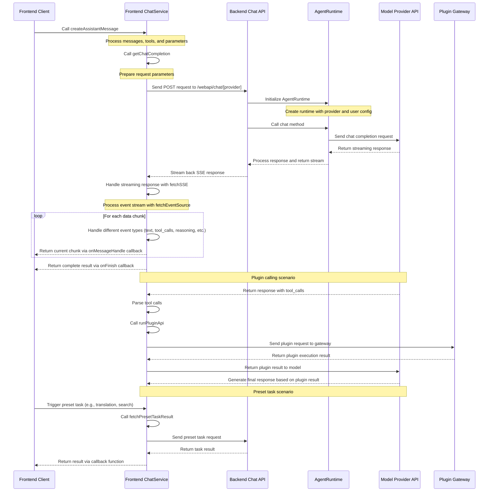

# Lobe Chat API Client-Server Interaction Logic

This document explains the implementation logic of Lobe Chat API in client-server interactions, including event sequences and core components involved.

#### TOC

- [Interaction Sequence Diagram](#interaction-sequence-diagram)
- [Main Process Steps](#main-process-steps)
- [AgentRuntime Overview](#agentruntime-overview)

## Interaction Sequence Diagram



## Main Process Steps

1. **Client Initiates Request**: The client calls the createAssistantMessage method of the frontend ChatService.

2. **Frontend Processes Request**:

   - `src/services/chat.ts` preprocesses messages, tools, and parameters
   - Calls getChatCompletion to prepare request parameters
   - Uses `src/utils/fetch/fetchSSE.ts` to send request to backend API

3. **Backend Processes Request**:

   - `src/app/(backend)/webapi/chat/[provider]/route.ts` receives the request
   - Initializes AgentRuntime
   - Creates the appropriate model instance based on user configuration and provider

4. **Model Call**:

   - `src/libs/agent-runtime/AgentRuntime.ts` calls the respective model provider's API
   - Returns streaming response

5. **Process Response**:

   - Backend converts model response to Stream and returns it
   - Frontend processes streaming response via fetchSSE and [fetchEventSource](https://github.com/Azure/fetch-event-source)
   - Handles different types of events (text, tool calls, reasoning, etc.)
   - Passes results back to client through callback functions

6. **Plugin Calling Scenario**:

   When the AI model returns a `tool_calls` field in its response, it triggers the plugin calling process:

   - AI model returns response containing `tool_calls`, indicating a need to call tools
   - Frontend handles tool calls via the `internal_callPluginApi` method
   - Calls `runPluginApi` method to execute plugin functionality, including retrieving plugin settings and manifest, creating authentication headers, and sending requests to the plugin gateway
   - After plugin execution completes, the result is returned to the AI model, which generates the final response based on the result

   **Real-world Examples**:

   - **Search Plugin**: When a user needs real-time information, the AI calls a web search plugin to retrieve the latest data
   - **DALL-E Plugin**: When a user requests image generation, the AI calls the DALL-E plugin to create images
   - **Midjourney Plugin**: Provides higher quality image generation capabilities by calling the Midjourney service via API

7. **Preset Task Processing**:

   Preset tasks are specific predefined functions that are typically triggered when users perform specific actions (rather than being part of the regular chat flow). These tasks use the `fetchPresetTaskResult` method, which is similar to the normal chat flow but uses specially designed prompt chains.

   **Execution Timing**: Preset tasks are mainly triggered in the following scenarios:

   1. **Agent Information Auto-generation**: Triggered when users create or edit an agent

      - Agent avatar generation (via `autoPickEmoji` method)
      - Agent description generation (via `autocompleteAgentDescription` method)
      - Agent tag generation (via `autocompleteAgentTags` method)
      - Agent title generation (via `autocompleteAgentTitle` method)

   2. **Message Translation**: Triggered when users manually click the translate button (via `translateMessage` method)

   3. **Web Search**: When search is enabled but the model doesn't support tool calling, search functionality is implemented via `fetchPresetTaskResult`

   **Code Examples**:

   Agent avatar auto-generation implementation:

   ```typescript
   // src/features/AgentSetting/store/action.ts
   autoPickEmoji: async () => {
     const { config, meta, dispatchMeta } = get();
     const systemRole = config.systemRole;

     chatService.fetchPresetTaskResult({
       onFinish: async (emoji) => {
         dispatchMeta({ type: 'update', value: { avatar: emoji } });
       },
       onLoadingChange: (loading) => {
         get().updateLoadingState('avatar', loading);
       },
       params: merge(
         get().internal_getSystemAgentForMeta(),
         chainPickEmoji([meta.title, meta.description, systemRole].filter(Boolean).join(',')),
       ),
       trace: get().getCurrentTracePayload({ traceName: TraceNameMap.EmojiPicker }),
     });
   };
   ```

   Translation feature implementation:

   ```typescript
   // src/store/chat/slices/translate/action.ts
   translateMessage: async (id, targetLang) => {
     // ...omitted code...

     // Detect language
     chatService.fetchPresetTaskResult({
       onFinish: async (data) => {
         if (data && supportLocales.includes(data)) from = data;
         await updateMessageTranslate(id, { content, from, to: targetLang });
       },
       params: merge(translationSetting, chainLangDetect(message.content)),
       trace: get().getCurrentTracePayload({ traceName: TraceNameMap.LanguageDetect }),
     });

     // Perform translation
     chatService.fetchPresetTaskResult({
       onMessageHandle: (chunk) => {
         if (chunk.type === 'text') {
           content = chunk.text;
           internal_dispatchMessage({
             id,
             type: 'updateMessageTranslate',
             value: { content, from, to: targetLang },
           });
         }
       },
       onFinish: async () => {
         await updateMessageTranslate(id, { content, from, to: targetLang });
         internal_toggleChatLoading(false, id, n('translateMessage(end)', { id }) as string);
       },
       params: merge(translationSetting, chainTranslate(message.content, targetLang)),
       trace: get().getCurrentTracePayload({ traceName: TraceNameMap.Translation }),
     });
   };
   ```

8. **Completion**:
   - When the stream ends, the onFinish callback is called, providing the complete response result

## AgentRuntime Overview

AgentRuntime is a core abstraction layer in Lobe Chat that encapsulates a unified interface for interacting with different AI model providers. Its main responsibilities and features include:

1. **Unified Abstraction Layer**: AgentRuntime provides a unified interface that hides the implementation details and differences between various AI provider APIs (such as OpenAI, Anthropic, Bedrock, etc.).

2. **Model Initialization**: Through the static `initializeWithProvider` method, it initializes the corresponding runtime instance based on the specified provider and configuration parameters.

3. **Capability Encapsulation**:

   - `chat` method: Handles chat streaming requests
   - `models` method: Retrieves model lists
   - Supports text embedding, text-to-image, text-to-speech, and other functionalities (if supported by the model provider)

4. **Plugin Architecture**: Through the `src/libs/agent-runtime/runtimeMap.ts` mapping table, it implements an extensible plugin architecture, making it easy to add new model providers. Currently, it supports over 40 different model providers:

   ```typescript
   export const providerRuntimeMap = {
     openai: LobeOpenAI,
     anthropic: LobeAnthropicAI,
     google: LobeGoogleAI,
     azure: LobeAzureOpenAI,
     bedrock: LobeBedrockAI,
     ollama: LobeOllamaAI,
     // ...over 40 other model providers
   };
   ```

5. **Adapter Pattern**: Internally, it uses the adapter pattern to adapt different provider APIs to the unified `src/libs/agent-runtime/BaseAI.ts` interface:

   ```typescript
   export interface LobeRuntimeAI {
     baseURL?: string;
     chat(payload: ChatStreamPayload, options?: ChatCompetitionOptions): Promise<Response>;
     embeddings?(payload: EmbeddingsPayload, options?: EmbeddingsOptions): Promise<Embeddings[]>;
     models?(): Promise<any>;
     textToImage?: (payload: TextToImagePayload) => Promise<string[]>;
     textToSpeech?: (
       payload: TextToSpeechPayload,
       options?: TextToSpeechOptions,
     ) => Promise<ArrayBuffer>;
   }
   ```

   **Adapter Implementation Examples**:

   1. **OpenRouter Adapter**:
      OpenRouter is a unified API that allows access to AI models from multiple providers. Lobe Chat implements support for OpenRouter through an adapter:

      ```typescript
      // OpenRouter adapter implementation
      class LobeOpenRouterAI implements LobeRuntimeAI {
        client: OpenAI;
        baseURL: string;

        constructor(options: OpenAICompatibleOptions) {
          // Initialize OpenRouter client using OpenAI-compatible API
          this.client = new OpenAI({
            apiKey: options.apiKey,
            baseURL: OPENROUTER_BASE_URL,
            defaultHeaders: {
              'HTTP-Referer': 'https://github.com/lobehub/lobe-chat',
              'X-Title': 'LobeChat',
            },
          });
          this.baseURL = OPENROUTER_BASE_URL;
        }

        // Implement chat functionality
        async chat(payload: ChatCompletionCreateParamsBase, options?: RequestOptions) {
          // Convert Lobe Chat request format to OpenRouter format
          // Handle model mapping, message format, etc.
          return this.client.chat.completions.create(
            {
              ...payload,
              model: payload.model || 'openai/gpt-4-turbo', // Default model
            },
            options,
          );
        }

        // Implement other LobeRuntimeAI interface methods
      }
      ```

   2. **Google Gemini Adapter**:
      Gemini is Google's large language model. Lobe Chat supports Gemini series models through a dedicated adapter:

      ```typescript
      import { GoogleGenerativeAI } from '@google/generative-ai';

      // Gemini adapter implementation
      class LobeGoogleAI implements LobeRuntimeAI {
        client: GoogleGenerativeAI;
        baseURL: string;
        apiKey: string;

        constructor(options: GoogleAIOptions) {
          // Initialize Google Generative AI client
          this.client = new GoogleGenerativeAI(options.apiKey);
          this.apiKey = options.apiKey;
          this.baseURL = options.baseURL || GOOGLE_AI_BASE_URL;
        }

        // Implement chat functionality
        async chat(payload: ChatCompletionCreateParamsBase, options?: RequestOptions) {
          // Select appropriate model (supports Gemini Pro, Gemini Flash, etc.)
          const modelName = payload.model || 'gemini-pro';
          const model = this.client.getGenerativeModel({ model: modelName });

          // Process multimodal inputs (e.g., images)
          const contents = this.processMessages(payload.messages);

          // Set generation parameters
          const generationConfig = {
            temperature: payload.temperature,
            topK: payload.top_k,
            topP: payload.top_p,
            maxOutputTokens: payload.max_tokens,
          };

          // Create chat session and get response
          const chat = model.startChat({
            generationConfig,
            history: contents.slice(0, -1),
            safetySettings: this.getSafetySettings(payload),
          });

          // Handle streaming response
          return this.handleStreamResponse(chat, contents, options?.signal);
        }

        // Implement other processing methods
        private processMessages(messages) {
          /* ... */
        }
        private getSafetySettings(payload) {
          /* ... */
        }
        private handleStreamResponse(chat, contents, signal) {
          /* ... */
        }
      }
      ```

   **Different Model Implementations**:

   - `src/libs/agent-runtime/openai/index.ts` - OpenAI implementation
   - `src/libs/agent-runtime/anthropic/index.ts` - Anthropic implementation
   - `src/libs/agent-runtime/google/index.ts` - Google implementation
   - `src/libs/agent-runtime/openrouter/index.ts` - OpenRouter implementation

For detailed implementation, see:

- `src/libs/agent-runtime/AgentRuntime.ts` - Core runtime class
- `src/libs/agent-runtime/BaseAI.ts` - Define base interface
- `src/libs/agent-runtime/runtimeMap.ts` - Provider mapping table
- `src/libs/agent-runtime/UniformRuntime/index.ts` - Handle multi-model unified runtime
- `src/libs/agent-runtime/utils/openaiCompatibleFactory/index.ts` - OpenAI compatible adapter factory
