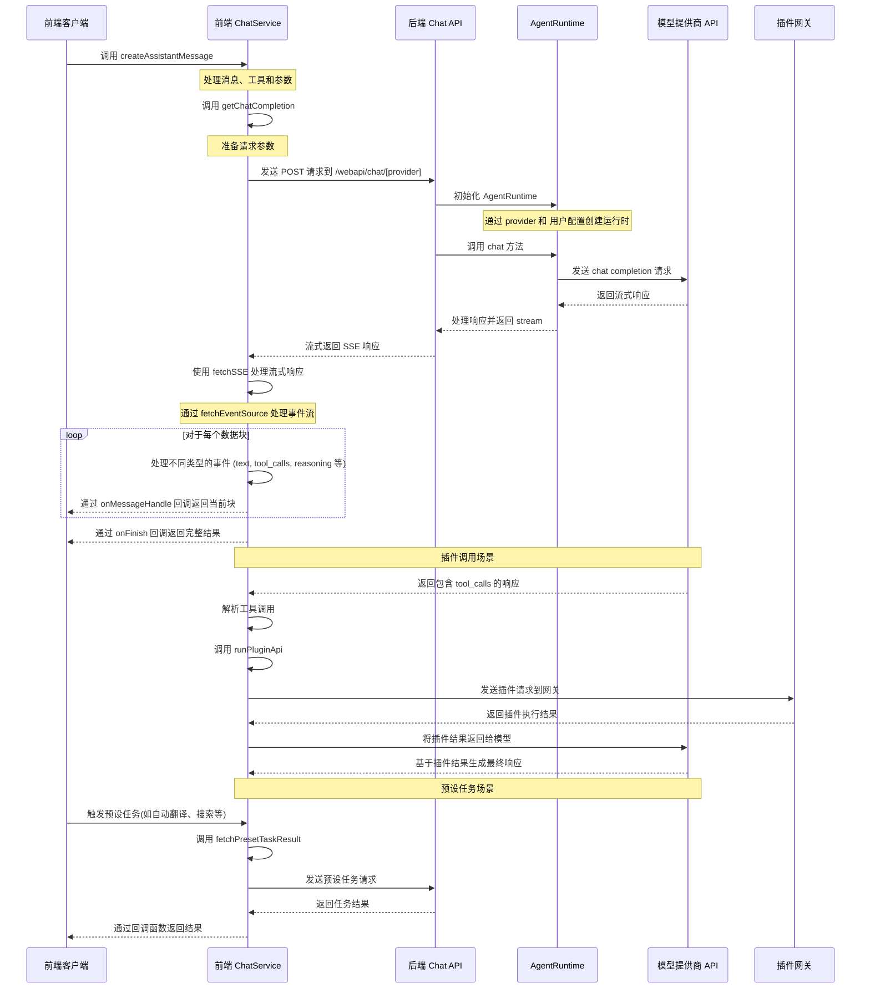

# Lobe Chat API 前后端交互逻辑

本文档说明了 Lobe Chat API 在前后端交互中的实现逻辑，包括事件序列和涉及的核心组件。

## 交互时序图



## 主要步骤说明

1. **客户端发起请求**：客户端调用前端 ChatService 的 createAssistantMessage 方法。

2. **前端处理请求**：

   - `src/services/chat.ts` 对消息、工具和参数进行预处理
   - 调用 getChatCompletion 准备请求参数
   - 使用 `src/utils/fetch/fetchSSE.ts` 发送请求到后端 API

3. **后端处理请求**：

   - `src/app/(backend)/webapi/chat/[provider]/route.ts` 接收请求
   - 初始化 AgentRuntime
   - 根据用户配置和提供商创建相应的模型实例

4. **模型调用**：

   - `src/libs/agent-runtime/AgentRuntime.ts` 调用相应模型提供商的 API
   - 返回流式响应

5. **处理响应**：

   - 后端将模型响应转换为 Stream 返回
   - 前端通过 fetchSSE 和 [fetchEventSource](https://github.com/Azure/fetch-event-source) 处理流式响应
   - 对不同类型的事件（文本、工具调用、推理等）进行处理
   - 通过回调函数将结果传递回客户端

6. **插件调用场景**：

   当 AI 模型在响应中返回 `tool_calls` 字段时，会触发插件调用流程：

   - AI 模型返回包含 `tool_calls` 的响应，表明需要调用工具
   - 前端通过 `internal_callPluginApi` 方法处理工具调用
   - 调用 `runPluginApi` 方法执行插件功能，包括获取插件设置和清单、创建认证请求头、发送请求到插件网关
   - 插件执行完成后，结果返回给 AI 模型，模型基于结果生成最终响应

   **实际应用示例**：

   - **搜索插件**：当用户需要获取实时信息时，AI 会调用网页搜索插件来获取最新数据
   - **DALL-E 插件**：用户要求生成图片时，AI 调用 DALL-E 插件创建图像
   - **Midjourney 插件**：提供更高质量的图像生成能力，通过 API 调用 Midjourney 服务

7. **预设任务处理**：

   预设任务是指系统预定义的特定功能任务，通常在用户执行特定操作时触发（而非常规聊天流程的一部分）。这些任务使用 `fetchPresetTaskResult` 方法执行，该方法与正常聊天流程类似，但会使用专门设计的提示词（prompt chain）。

   **执行时机**：预设任务主要在以下场景被触发：

   1. **角色信息自动生成**：当用户创建或编辑角色时触发

      - 角色头像生成（通过 `autoPickEmoji` 方法）
      - 角色描述生成（通过 `autocompleteAgentDescription` 方法）
      - 角色标签生成（通过 `autocompleteAgentTags` 方法）
      - 角色标题生成（通过 `autocompleteAgentTitle` 方法）

   2. **消息翻译**：用户手动点击翻译按钮时触发（通过 `translateMessage` 方法）

   3. **网页搜索**：当启用搜索但模型不支持工具调用时，通过 `fetchPresetTaskResult` 实现搜索功能

   **实际代码示例**：

   角色头像自动生成实现：

   ```ts
   // src/features/AgentSetting/store/action.ts
   autoPickEmoji: async () => {
     const { config, meta, dispatchMeta } = get();
     const systemRole = config.systemRole;

     chatService.fetchPresetTaskResult({
       onFinish: async (emoji) => {
         dispatchMeta({ type: 'update', value: { avatar: emoji } });
       },
       onLoadingChange: (loading) => {
         get().updateLoadingState('avatar', loading);
       },
       params: merge(
         get().internal_getSystemAgentForMeta(),
         chainPickEmoji([meta.title, meta.description, systemRole].filter(Boolean).join(',')),
       ),
       trace: get().getCurrentTracePayload({ traceName: TraceNameMap.EmojiPicker }),
     });
   };
   ```

   翻译功能实现：

   ```ts
   // src/store/chat/slices/translate/action.ts
   translateMessage: async (id, targetLang) => {
     // ...省略部分代码...

     // 检测语言
     chatService.fetchPresetTaskResult({
       onFinish: async (data) => {
         if (data && supportLocales.includes(data)) from = data;
         await updateMessageTranslate(id, { content, from, to: targetLang });
       },
       params: merge(translationSetting, chainLangDetect(message.content)),
       trace: get().getCurrentTracePayload({ traceName: TraceNameMap.LanguageDetect }),
     });

     // 执行翻译
     chatService.fetchPresetTaskResult({
       onMessageHandle: (chunk) => {
         if (chunk.type === 'text') {
           content = chunk.text;
           internal_dispatchMessage({
             id,
             type: 'updateMessageTranslate',
             value: { content, from, to: targetLang },
           });
         }
       },
       onFinish: async () => {
         await updateMessageTranslate(id, { content, from, to: targetLang });
         internal_toggleChatLoading(false, id, n('translateMessage(end)', { id }) as string);
       },
       params: merge(translationSetting, chainTranslate(message.content, targetLang)),
       trace: get().getCurrentTracePayload({ traceName: TraceNameMap.Translation }),
     });
   };
   ```

8. **完成**：
   - 当流结束时，调用 onFinish 回调，提供完整的响应结果

## AgentRuntime 说明

AgentRuntime 是 Lobe Chat 中的一个核心抽象层，它封装了与不同 AI 模型提供商交互的统一接口。其主要职责和特点包括：

1. **统一抽象层**：AgentRuntime 提供了一个统一的接口，隐藏了不同 AI 提供商 API 的实现细节差异（如 OpenAI、Anthropic、Bedrock 等）。

2. **模型初始化**：通过 `initializeWithProvider` 静态方法，根据指定的提供商和配置参数初始化对应的运行时实例。

3. **能力封装**：

   - `chat` 方法：处理聊天流式请求
   - `models` 方法：获取模型列表
   - 支持文本嵌入、文本到图像、文本到语音等功能（如果模型提供商支持）

4. **插件化架构**：通过 `src/libs/agent-runtime/runtimeMap.ts` 映射表，实现了可扩展的插件化架构，方便添加新的模型提供商。目前支持超过 40 个不同的模型提供商：

   ```ts
   export const providerRuntimeMap = {
     openai: LobeOpenAI,
     anthropic: LobeAnthropicAI,
     google: LobeGoogleAI,
     azure: LobeAzureOpenAI,
     bedrock: LobeBedrockAI,
     ollama: LobeOllamaAI,
     // ...其他40多个模型提供商
   };
   ```

5. **适配器模式**：在内部使用适配器模式，将不同提供商的 API 适配到统一的 `src/libs/agent-runtime/BaseAI.ts` 接口：

   ```ts
   export interface LobeRuntimeAI {
     baseURL?: string;
     chat(payload: ChatStreamPayload, options?: ChatCompetitionOptions): Promise<Response>;
     embeddings?(payload: EmbeddingsPayload, options?: EmbeddingsOptions): Promise<Embeddings[]>;
     models?(): Promise<any>;
     textToImage?: (payload: TextToImagePayload) => Promise<string[]>;
     textToSpeech?: (
       payload: TextToSpeechPayload,
       options?: TextToSpeechOptions,
     ) => Promise<ArrayBuffer>;
   }
   ```

   **适配器实现示例**：

   1. **OpenRouter 适配器**：OpenRouter 是一个统一 API，可以通过它访问多个模型提供商的 AI 模型。Lobe Chat 通过适配器实现对 OpenRouter 的支持：

      ```ts
      // OpenRouter 适配器实现
      class LobeOpenRouterAI implements LobeRuntimeAI {
        client: OpenAI;
        baseURL: string;

        constructor(options: OpenAICompatibleOptions) {
          // 初始化 OpenRouter 客户端，使用 OpenAI 兼容的 API
          this.client = new OpenAI({
            apiKey: options.apiKey,
            baseURL: OPENROUTER_BASE_URL,
            defaultHeaders: {
              'HTTP-Referer': 'https://github.com/lobehub/lobe-chat',
              'X-Title': 'LobeChat',
            },
          });
          this.baseURL = OPENROUTER_BASE_URL;
        }

        // 实现聊天功能
        async chat(payload: ChatCompletionCreateParamsBase, options?: RequestOptions) {
          // 将 Lobe Chat 的请求格式转换为 OpenRouter 格式
          // 处理模型映射、消息格式等
          return this.client.chat.completions.create(
            {
              ...payload,
              model: payload.model || 'openai/gpt-4-turbo', // 默认模型
            },
            options,
          );
        }

        // 实现其他 LobeRuntimeAI 接口方法
      }
      ```

   2. **Google Gemini 适配器**：Gemini 是 Google 的大语言模型，Lobe Chat 通过专门的适配器支持 Gemini 系列模型：

      ```ts
      import { GoogleGenerativeAI } from '@google/generative-ai';

      // Gemini 适配器实现
      class LobeGoogleAI implements LobeRuntimeAI {
        client: GoogleGenerativeAI;
        baseURL: string;
        apiKey: string;

        constructor(options: GoogleAIOptions) {
          // 初始化 Google Generative AI 客户端
          this.client = new GoogleGenerativeAI(options.apiKey);
          this.apiKey = options.apiKey;
          this.baseURL = options.baseURL || GOOGLE_AI_BASE_URL;
        }

        // 实现聊天功能
        async chat(payload: ChatCompletionCreateParamsBase, options?: RequestOptions) {
          // 选择合适的模型（支持 Gemini Pro、Gemini Flash 等）
          const modelName = payload.model || 'gemini-pro';
          const model = this.client.getGenerativeModel({ model: modelName });

          // 处理多模态输入（如图像）
          const contents = this.processMessages(payload.messages);

          // 设置生成参数
          const generationConfig = {
            temperature: payload.temperature,
            topK: payload.top_k,
            topP: payload.top_p,
            maxOutputTokens: payload.max_tokens,
          };

          // 创建聊天会话并获取响应
          const chat = model.startChat({
            generationConfig,
            history: contents.slice(0, -1),
            safetySettings: this.getSafetySettings(payload),
          });

          // 处理流式响应
          return this.handleStreamResponse(chat, contents, options?.signal);
        }

        // 实现其他处理方法
        private processMessages(messages) {
          /* ... */
        }
        private getSafetySettings(payload) {
          /* ... */
        }
        private handleStreamResponse(chat, contents, signal) {
          /* ... */
        }
      }
      ```

   **不同模型的适配实现**：

- `src/libs/agent-runtime/openai/index.ts` - OpenAI 实现
- `src/libs/agent-runtime/anthropic/index.ts` - Anthropic 实现
- `src/libs/agent-runtime/google/index.ts` - Google 实现
- `src/libs/agent-runtime/openrouter/index.ts` - OpenRouter 实现

详细实现可以查看：

- `src/libs/agent-runtime/AgentRuntime.ts` - 核心运行时类
- `src/libs/agent-runtime/BaseAI.ts` - 定义基础接口
- `src/libs/agent-runtime/runtimeMap.ts` - 提供商映射表
- `src/libs/agent-runtime/UniformRuntime/index.ts` - 处理多模型统一运行时
- `src/libs/agent-runtime/utils/openaiCompatibleFactory/index.ts` - OpenAI 兼容适配器工厂
